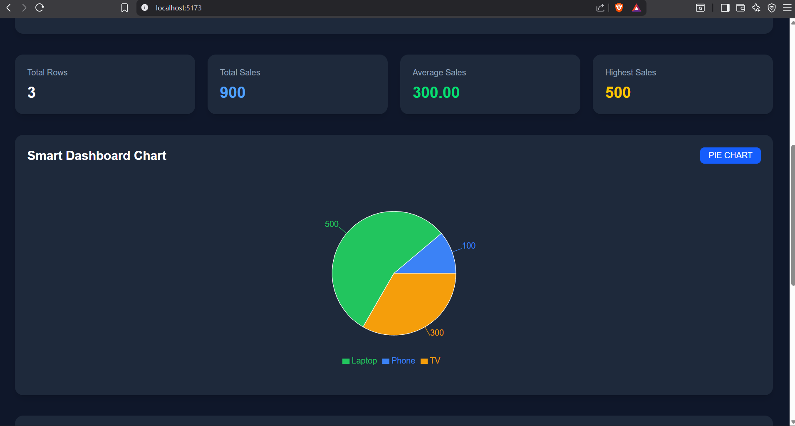
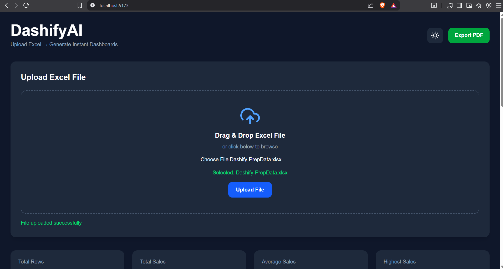
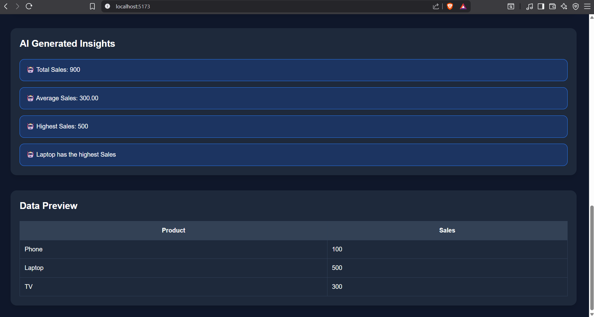

# DashifyAI 📊🤖

DashifyAI is a modern AI-powered analytics dashboard platform that converts Excel files into interactive dashboards automatically.

Users can upload Excel sheets and instantly generate:
- Smart charts
- KPI analytics
- AI-generated insights
- Downloadable PDF reports

Built using React, Flask, Tailwind CSS, and Recharts.

---

# 🚀 Features

## 📂 Excel Upload
- Upload `.xlsx` and `.xls` files
- Drag & drop support

## 📊 Smart Chart Detection
Automatically generates:
- Bar charts
- Line charts
- Pie charts

based on uploaded data.

## 📈 KPI Analytics
Automatically calculates:
- Total values
- Average values
- Highest values
- Total rows

## 🤖 AI Generated Insights
Generates automatic business insights from uploaded data.

## 🌗 Theme System
- Dark mode
- Light mode

## 📄 PDF Export
Download dashboard reports instantly as PDF.

## ✨ Modern UI
- Responsive design
- Smooth animations
- Professional dashboard layout

# 📷 Screenshots

## Dashboard Preview




---

# 🛠 Tech Stack

## Frontend
- React.js
- Tailwind CSS
- Framer Motion
- Recharts

## Backend
- Flask
- Pandas
- OpenPyXL

---

# 📦 Installation

## Clone Repository

```bash
git clone https://github.com/YOUR_USERNAME/DashifyAI.git